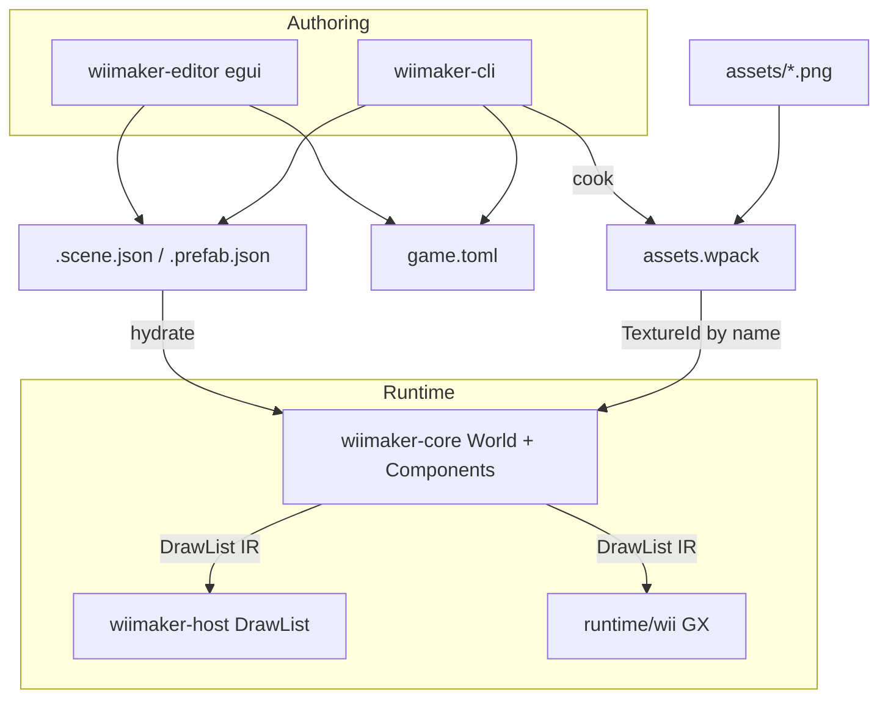

# WiiMaker Editor + Agent CLI

## Locked decisions

- **Ship both thin together**: shared scene format from day one; every editor mutation has a CLI twin.
- **Editor tech**: egui inside the host window (`wiimaker edit`), reusing the existing `DrawList` viewport.
- **Unity mental model** (names matter more than a full Unity clone):

| Unity | WiiMaker |
|---|---|
| Project | `game.toml` + `assets/` + `scenes/` |
| Scene | `.scene.json` |
| GameObject | Entity (`name` + `Transform` + components) |
| Component | Typed bags: `Sprite`, `Disc`, `Camera`, `Tag` |
| Prefab | `.prefab.json` |
| Hierarchy / Inspector / Project / Scene | egui panels |
| Play | existing `App` + host loop |

## Architecture



**Source of truth**: files on disk. Editor and CLI only mutate files (or an in-memory dirty buffer that saves). Play/runtime loads scenes; it never owns the authoring model.

## New crates / modules

| Piece | Path | Role |
|---|---|---|
| Scene schema + hydrate | new `crates/wiimaker-scene` | serde types, load/save, `Scene → World` |
| Editor UI | new `crates/wiimaker-editor` | egui panels + host window shell |
| Components | extend [`wiimaker-core/src/world.rs`](crates/wiimaker-core/src/world.rs) | `Sprite` / `Disc` / `Camera` on entities |
| Asset cook helpers | [`wiimaker-assets`](crates/wiimaker-assets/src/lib.rs) | PoT pad, name lookup, cook-from-`game.toml` |
| CLI surface | [`wiimaker-cli`](crates/wiimaker-cli/src/main.rs) | scene/entity/asset/doctor/edit |

Keep `wiimaker-core` lean and `no_std`-ready: scene serde stays in `wiimaker-scene` (std + serde).

## Project + scene format

`games/<name>/game.toml`:

```toml
name = "hello-orb"
title = "wiimaker · hello-orb"
default_scene = "scenes/main.scene.json"
assets_dir = "assets"
wpack = "assets.wpack"
```

`scenes/main.scene.json` (agent-friendly JSON):

```json
{
  "name": "main",
  "clear_color": [12, 18, 32, 255],
  "entities": [
    {
      "name": "Player",
      "transform": { "translation": [320, 240, 0], "rotation": [0,0,0,1], "scale": [1,1,1] },
      "components": {
        "Sprite": { "texture": "male_civilian", "size": [32, 32], "color": [255,255,255,255], "z": 0 }
      }
    },
    {
      "name": "Orb",
      "transform": { "translation": [400, 200, 0], "rotation": [0,0,0,1], "scale": [1,1,1] },
      "components": {
        "Disc": { "radius": 36, "color": [80, 200, 255, 255], "z": 1 }
      }
    }
  ]
}
```

Prefabs are the same entity blob without scene wrapper: `assets/prefabs/player.prefab.json`.

## Runtime model (Unity-shaped, not full ECS)

Extend `World` beyond transform+tag:

- `name: String` (Hierarchy label)
- Component table keyed by `EntityId`: `Sprite`, `Disc`, `Camera` (v0 set only)
- `ScenePlayer` helper in `wiimaker-scene`: each frame walks sprites/discs → `DrawList` (replaces hand-rolled `render` in simple games)

Gameplay scripts stay as Rust `App` (like MonoBehaviour code): load scene once in `init`, then tweak entities in `update`. No visual scripting in v0.

## egui editor (`wiimaker edit <game>`)

Host window split:

```
┌────────────┬──────────────────────────┬────────────┐
│ Hierarchy  │     Scene viewport       │ Inspector  │
│ entities   │   (DrawList raster)      │ transform  │
│            │                          │ components │
├────────────┴──────────────────────────┴────────────┤
│ Project: assets / scenes / cooked wpack status     │
└────────────────────────────────────────────────────┘
```

- **Hierarchy**: list entities, create/rename/delete, reorder
- **Inspector**: edit Transform + known components; Add Component menu
- **Scene viewport**: existing software raster of the loaded scene; click-select later (v0: selection via Hierarchy only)
- **Project**: browse `assets/`, show cook warnings (e.g. non-PoT `cyber_rover.png`)
- **Save / dirty flag**: write `.scene.json`; **Play** button shells `wiimaker run` or in-process play mode

Implementation: new host path using **winit + egui + egui-wgpu or egui software** for chrome, with the game viewport blitted as a texture/region from the existing [`raster.rs`](crates/wiimaker-host/src/raster.rs). Keep plain `wiimaker run` on minifb for zero-egui play speed.

## Agent-first CLI (mirrors editor)

Every command supports `--json` for machine output.

```text
wiimaker new <name>                 # scaffold game.toml + empty main scene + assets/
wiimaker edit <name>                # open egui editor
wiimaker run <name>
wiimaker cook <name>                # cook from game.toml (pad non-PoT with warning)
wiimaker doctor <name>              # missing textures, bad PoT, broken scene refs

wiimaker scene list <game>
wiimaker scene show <game> [scene]
wiimaker scene set-clear <game> --rgb 12,18,32

wiimaker entity list <game> [--scene main]
wiimaker entity add <game> --name Player --sprite male_civilian --x 320 --y 240
wiimaker entity set <game> --name Player --x 100 --y 200
wiimaker entity add-component <game> --name Player Disc --radius 36
wiimaker entity remove <game> --name Player

wiimaker asset list <game>
wiimaker asset import <game> path/to.png   # copy into assets/, optional resize-to-PoT
```

Agents build games as: `new` → `asset import` → `entity add` → `cook` → `run` / `build-wii`.

## hello-orb as the proving ground

1. Fix/cook sample assets under [`games/hello-orb/assets`](games/hello-orb/assets) (`cyber_rover` is 46×46 — cooker pads to next PoT with a warning).
2. Convert hello-orb to `game.toml` + `scenes/main.scene.json` using the three sprites + the existing disc orb as a `Disc` entity.
3. Thin `main.rs`: load scene, stick-move `Player`, keep pulse on A — proves code + data coauthoring.

## Implementation phases

### Phase 1 — Authoring foundation (unblocks agents)
- Add `wiimaker-scene` (JSON schema, load/save, hydrate → World)
- Grow `World` with named entities + Sprite/Disc/Camera components
- Default scene renderer → `DrawList`
- Wire host rasterizer to sample textures from a loaded `.wpack` (closes M1 gap for sprites)
- CLI: `cook <game>`, `doctor`, `scene *`, `entity *`, `asset *`
- Migrate hello-orb to scene + assets

### Phase 2 — Thin egui editor
- `wiimaker-editor` crate + `wiimaker edit`
- Hierarchy / Inspector / Project panels that call the same mutation helpers as the CLI
- Viewport shows live scene; Save writes JSON
- Play launches host run

### Phase 3 — Prefabs + polish
- Prefab instantiate from editor/CLI
- Multi-scene list in Project
- Selection gizmo (translate) in viewport
- Document Unity → WiiMaker cheat sheet in README

## Key files to touch

- New: `crates/wiimaker-scene/`, `crates/wiimaker-editor/`
- Extend: [`crates/wiimaker-core/src/world.rs`](crates/wiimaker-core/src/world.rs), [`crates/wiimaker-host/src/raster.rs`](crates/wiimaker-host/src/raster.rs), [`crates/wiimaker-cli/src/main.rs`](crates/wiimaker-cli/src/main.rs), [`crates/wiimaker-assets/src/lib.rs`](crates/wiimaker-assets/src/lib.rs)
- Prove on: [`games/hello-orb/`](games/hello-orb/)
- Update: [`ARCHITECTURE.md`](ARCHITECTURE.md) (Milestone 3 scene/prefab pulled forward into authoring track)

## Out of scope (v0)

- Visual scripting / Blueprints
- Full ECS archetypes / queries UI
- TEV material editor
- Wiimote IR picking
- Editing C/GX bootstrap from the editor
